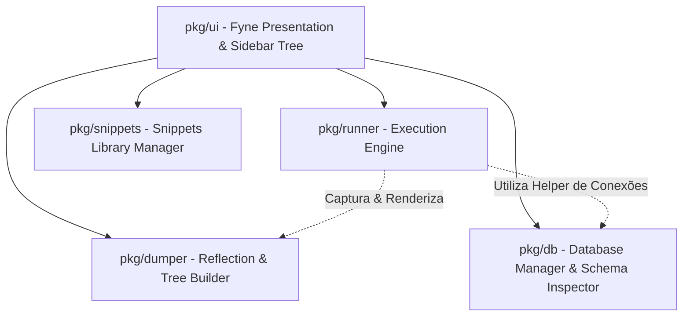

# Especificação Técnica: GoScratch

## 1. Arquitetura de Pacotes

Conforme definido na [constitution.md](file:///home/ercy/Development/GoScratch/spec/constitution.md), o GoScratch é dividido de forma desacoplada nos seguintes pacotes principais em Go:



---

## 2. Pacote `pkg/db` (Gerenciador de Banco de Dados)

### 2.1. Contrato da Interface Go
```go
package db

import (
	"context"
	"database/sql"
)

type DriverType string

const (
	DriverSQLite   DriverType = "sqlite"
	DriverPostgres DriverType = "postgres"
	DriverMySQL    DriverType = "mysql"
)

type ConnectionConfig struct {
	ID       string     `json:"id"`
	Name     string     `json:"name"`
	Driver   DriverType `json:"driver"`
	ConnStr  string     `json:"conn_str"`
}

type ColumnMetadata struct {
	Name         string `json:"name"`
	DataType     string `json:"data_type"`
	IsPrimaryKey bool   `json:"is_primary_key"`
}

type TableMetadata struct {
	Name    string           `json:"name"`
	Columns []ColumnMetadata `json:"columns"`
}

type DBManager interface {
	SaveConnection(cfg ConnectionConfig) error
	ListConnections() ([]ConnectionConfig, error)
	DeleteConnection(id string) error
	GetDB(id string) (*sql.DB, error)
	GetTables(ctx context.Context, id string) ([]TableMetadata, error)
}
```

---

## 3. Pacote `pkg/dumper` (Suporte a `sql.Rows`)

### 3.1. Tratamento de `*sql.Rows`
O `pkg/dumper` implementa verificação especial para `*sql.Rows`:
```go
if rows, ok := v.(*sql.Rows); ok && rows != nil {
    // 1. Extrai nomes das colunas via rows.Columns()
    // 2. Itera registros via rows.Next() e rows.Scan()
    // 3. Monta nó DumpNode do tipo KindSlice com filhotes representando cada linha como um KindStruct ou KindMap
}
```

---

## 4. Pacote `pkg/snippets` (Biblioteca de Código)

```go
package snippets

type Snippet struct {
	Name     string `json:"name"`
	Path     string `json:"path"`
	Content  string `json:"content"`
	IsFolder bool   `json:"is_folder"`
}

type SnippetManager interface {
	ListSnippets() ([]Snippet, error)
	SaveSnippet(name string, content string) error
	DeleteSnippet(name string) error
}
```

---

## 5. Pacote `pkg/ui` (Sidebar em Árvore Fyne)

### 5.1. Componente `pkg/ui/sidebar.go`
* Utiliza um `widget.Tree` ou `container.NewAccordion` posicionado à esquerda do Editor.
* **Estrutura da Árvore:**
  - **📁 Snippets Salvos**
    - `meu_script.go`
    - `teste_api.go`
  - **🗄️ Conexões de Banco**
    - **🔌 SQLite Dev (`sqlite.db`)**
      - **📊 users**
        - `id (INTEGER, PK)`
        - `email (TEXT)`
        - `created_at (DATETIME)`
      - **📊 orders**
* **Ações ao Clicar:**
  - Duplo clique em arquivo snippet: Carrega conteúdo no Editor de Código.
  - Duplo clique em Tabela do Banco: Gera automaticamente snippet de consulta no Editor (`db, _ := Connect("sqlite_dev"); rows, _ := db.Query("SELECT * FROM users LIMIT 50"); Dump(rows)`).
